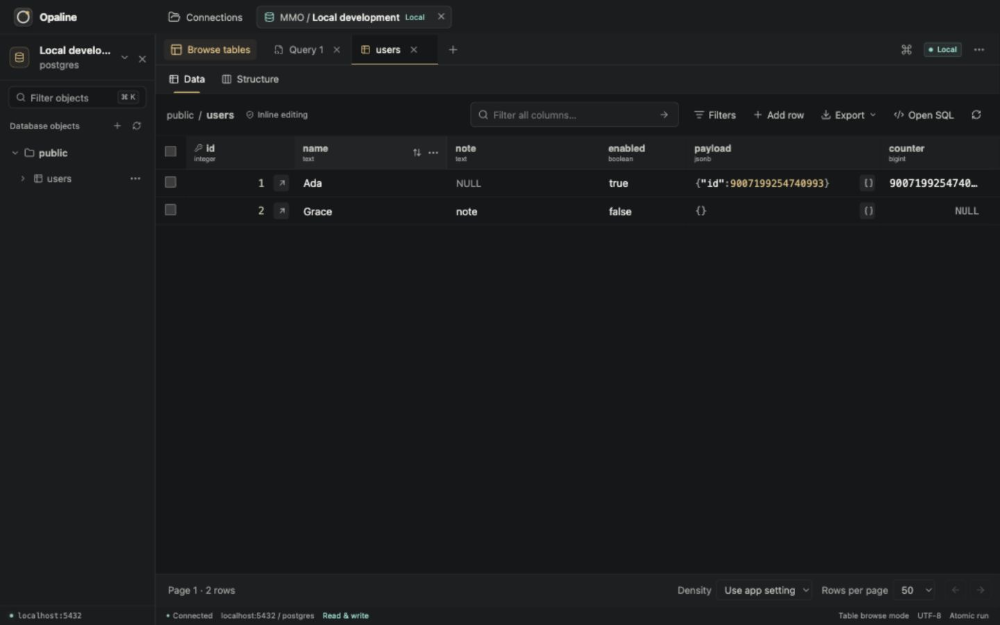
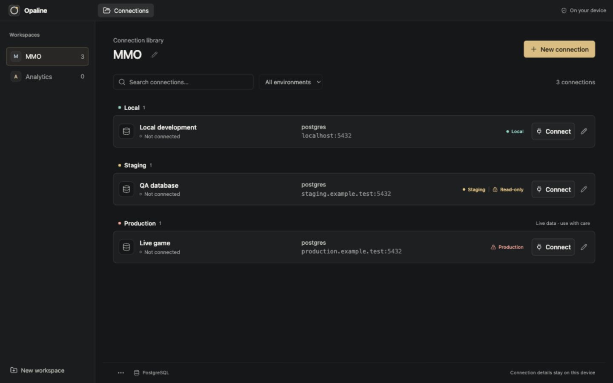

<div align="center">
  

  <h1>Opaline</h1>

  <p><strong>A calmer way to work with PostgreSQL.</strong></p>
  <p>An open-source desktop client for your databases, queries, and everyday work.<br />Local-first. No account. No telemetry.</p>

  <p>
    <a href="https://github.com/Kasperekx/opaline/actions/workflows/check.yml"></a>
    <a href="LICENSE"></a>
    <a href="#project-status"></a>
  </p>

  <p>
    <a href="#features">Features</a> &nbsp;·&nbsp;
    <a href="#getting-started">Get started</a> &nbsp;·&nbsp;
    <a href="docs/tester-guide.md">Tester guide</a> &nbsp;·&nbsp;
    <a href="#roadmap">Roadmap</a> &nbsp;·&nbsp;
    <a href="CONTRIBUTING.md">Contribute</a>
  </p>
</div>

<p align="center">
  <a href="docs/screenshots/readme-table.jpg">
    
  </a>
  <br />
  <sub>Current UI · September 23, 2026. Captured from the browser preview using synthetic data; native macOS window chrome is not shown.</sub>
</p>

## Built around your workflow

A workspace for each product. A clear place for every environment. SQL when you
need it, direct table editing when you don't.

Opaline brings connections, queries, data, structure, and backups into one focused
desktop workspace. It is free to use, modify, and self-build under the MIT license.

## Features

| Workflow | What you can do |
| :--- | :--- |
| **Product workspaces** | Group connections by product, label Local / Staging / Production, and switch between independent sessions without losing your place. |
| **A focused SQL editor** | Write with schema-aware completion, format with Undo, open SQL files, keep a query library, and cancel long-running queries. Atomic execution by default; explicit autocommit when you need it. |
| **Direct data editing** | Double-click a cell, stage changes, review the diff, and save together. Add, duplicate, or delete rows with visible drafts and conflict checks. |
| **Structure at a glance** | Inspect columns, indexes, constraints, foreign keys, and DDL. Browse, filter, sort, copy, and export data to CSV or JSON. |
| **Database diagrams** | Automatically map accessible tables and declared foreign keys. Search, focus on related tables, inspect relationships, and keep your layout. [Diagram guide](docs/database-diagrams.md). |
| **Table structure editing** | Create tables, rename tables and columns, add/remove columns, and drop tables from the explorer or diagram. Review generated SQL before applying; destructive changes require confirmation. [Scope and safeguards](docs/table-structure-editor.md). |
| **PostgreSQL enums** | Choose existing enum types for columns, create types, rename labels, and append values through the structure editor and SQL review. Edit enum cells with a value picker. [Enum guide and limits](docs/enum-types.md). |
| **Backup without tool setup** | Create custom or SQL backups with automatically selected, bundled PostgreSQL clients. Restore a trusted dump into an existing or newly created database. |
| **Desktop details** | Resizable panels, keyboard shortcuts, contextual actions, adjustable text size, and interface density. Passwords in the system credential store; verified TLS with optional custom CAs. |

### Edit first. Save deliberately.

1. **Double-click or F2** opens a cell editor.
2. **Enter** stages the value locally. The table shows what is still unsaved.
3. **Save changes or ⌘S** writes that table's pending changes in one transaction.

For multiline and JSON values, Enter adds a line; use Apply or ⌘Enter to stage the edit.

Duplicating a row creates a draft, not an immediate INSERT. If another client has
changed the same row, Opaline checks for a conflict instead of silently overwriting it.

[Explore the full feature guide →](docs/features.md)

<details>
<summary><strong>A workspace for every product</strong></summary>

<br />



Current browser preview, captured September 23, 2026 with synthetic endpoints. Each connection keeps its own
query tabs, results, and table drafts.

</details>

## Project status

> [!IMPORTANT]
> **Preparing the first macOS pilot.** No public beta download is available yet.
> The initial pilot will be unsigned and not notarized by Apple. CI installers
> and local QA packages are test artifacts, not approved releases.
> Use disposable or non-production data while testing.

- **First target:** macOS. Local native acceptance has been run on Apple Silicon
  with macOS 26.3; some scenarios remain open. This does not establish a minimum OS.
- **Platform qualification:** separate Apple Silicon and Intel build jobs exist,
  but Intel, older macOS versions, and installation on an independent Mac still
  need acceptance results before we claim support.
- **Database scope:** PostgreSQL only. Integration checks cover PostgreSQL 14–18;
  backup and restore are same-major operations, not a cross-version migration tool.
- **Later:** Windows and Linux. Their project configuration is not a support guarantee.

For testing instructions and known limits, read the [tester guide](docs/tester-guide.md).
The [latest verification report](docs/beta-enum-verification-2026-09-23.md) records
enum coverage, PostgreSQL 14–18 integration checks, native backup/restore checks,
and remaining gaps. The [pilot checklist](docs/beta-pilot.md) defines what must
pass before distributing a build.

## Getting started

### Build and run on macOS

There is no public beta download yet. To explore the current app, build from source.

You'll need:

- **Node.js 22 (22.13+) or 24+** and npm.
- **Rustup** — the repository pins Rust **1.88.0**.
- **Xcode Command Line Tools**, following the [Tauri prerequisites](https://v2.tauri.app/start/prerequisites/#macos).
- **OpenSSL 3** for the bundled PostgreSQL clients, available with `brew install openssl@3`.
  See the [client build requirements](docs/bundled-postgres.md#developerci-setup--not-end-user-instructions) for alternatives.

```sh
git clone https://github.com/Kasperekx/opaline.git
cd opaline
npm ci
npm run tauri dev
```

The first desktop build downloads and compiles the pinned PostgreSQL client tools;
allow extra time and internet access. Later builds reuse a verified local cache.
**End users do not need to install PostgreSQL client tools.** Opaline does not
bundle a database server; connect to an existing PostgreSQL instance.

To build a local desktop bundle:

```sh
npm run tauri build
```

Local builds are unsigned test builds. For an explicitly shared pilot build,
follow the [tester guide](docs/tester-guide.md) and verify its source and checksum.
Do not disable macOS security protections globally to launch the app.

### Make your first connection

Create a workspace → add a connection → choose its environment and access mode →
test and save → connect.

Open a table from the explorer or write SQL and press **⌘Enter**. Prefer required,
verified TLS for remote databases and a least-privileged PostgreSQL role.

<details>
<summary><strong>Development checks and integration tests</strong></summary>

Run from the repository root:

```sh
npm run check
cargo fmt --manifest-path src-tauri/Cargo.toml --check
cargo clippy --locked --manifest-path src-tauri/Cargo.toml --all-targets -- -D warnings
cargo test --locked --manifest-path src-tauri/Cargo.toml --lib
```

The default Rust suite is not the full database matrix. Some tests are opt-in or
require a configured disposable server.

With Docker installed, run the self-contained PostgreSQL 14–18 matrix:

```sh
npm run desktop:prepare
node scripts/test-bundled-postgres.mjs
```

The matrix creates disposable servers on random loopback ports. Never point
integration tests at a real product database. See [Contributing](CONTRIBUTING.md)
for security checks and review expectations.

</details>

## Local-first, with clear boundaries

Connections go from the Rust backend directly to PostgreSQL. There is no Opaline
server, hosted relay, required account, or automatic telemetry.

- **Credentials:** profiles contain settings, never passwords. Remembered passwords
  use the system vault — Keychain on macOS — with no plaintext fallback.
- **Queries:** SQL drafts, history, and saved-query libraries are local and
  **not encrypted by Opaline**. Avoid embedding secrets in SQL.
- **Table drafts:** pending edits and results stay in memory. They survive tab
  switches, not crashes or Force Quit.
- **Writes:** production access requires a warning acknowledgment; it is not forced
  read-only. Autocommit is explicit, per tab, and resets on reconnect or restart.
- **Database privileges:** read-only mode is an accidental-write safeguard, not
  a sandbox. Trusted dumps can execute database code. Opaline never retries writes
  automatically after an uncertain outcome.

Read the [security and privacy policy](SECURITY.md) before connecting sensitive data.

## Under the hood

**Tauri 2** · **Rust** · **React 19** · **TypeScript** · **CodeMirror 6** · **Rustls**

The webview handles the interface; session-scoped Rust commands handle database
access, credentials, files, and background operations. Features are split by
responsibility, with shared UI and a typed command boundary. The aim is simple:
small modules, explicit ownership, and abstractions only where they earn their place.

## Roadmap

The next milestone is a dependable **macOS beta**:

- Complete data-integrity, failure-recovery, security, and accessibility acceptance.
- Measure large-data performance and finish native desktop QA.
- Qualify the unsigned installer on an independent Mac and record supported OS/architecture combinations.
- Establish a private vulnerability-reporting channel and build a traceable candidate from a clean commit with passing CI.
- Run a small pilot, fix blockers, and publish only after release approval.
- Add Developer ID signing and notarization later; these are not part of the initial unsigned pilot.

Windows/Linux, SSH, and potential Kafka or Docker-log integrations are
outside the first beta. They are future directions, not available features or
release promises.

[Follow the ordered beta checklist →](docs/beta-readiness.md)

## Help shape Opaline

Bug reports, thoughtful UX feedback, and focused pull requests are welcome.
Use synthetic data in screenshots and examples; never include credentials or
customer records.

[Report a bug or suggest an improvement](https://github.com/Kasperekx/opaline/issues/new/choose)
· [Read the contribution guide](CONTRIBUTING.md)

For suspected vulnerabilities, follow [SECURITY.md](SECURITY.md), not public Issues.
Discuss substantial features before implementing them so scope and safety can be
reviewed together.

---

<p align="center">
  <strong>Opaline</strong> — a calmer place for your databases.<br />
  <a href="LICENSE">MIT License</a> · © 2026 Opaline contributors
</p>
